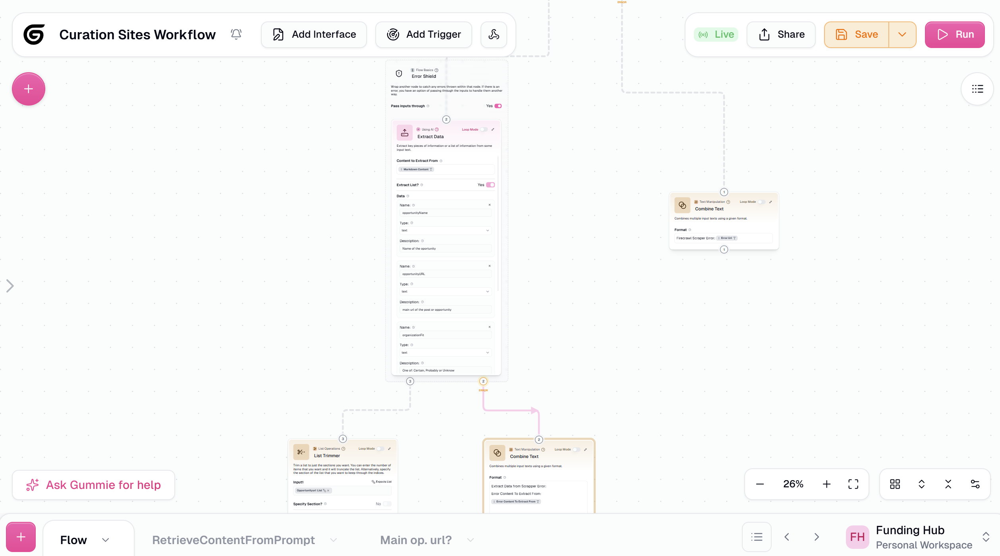
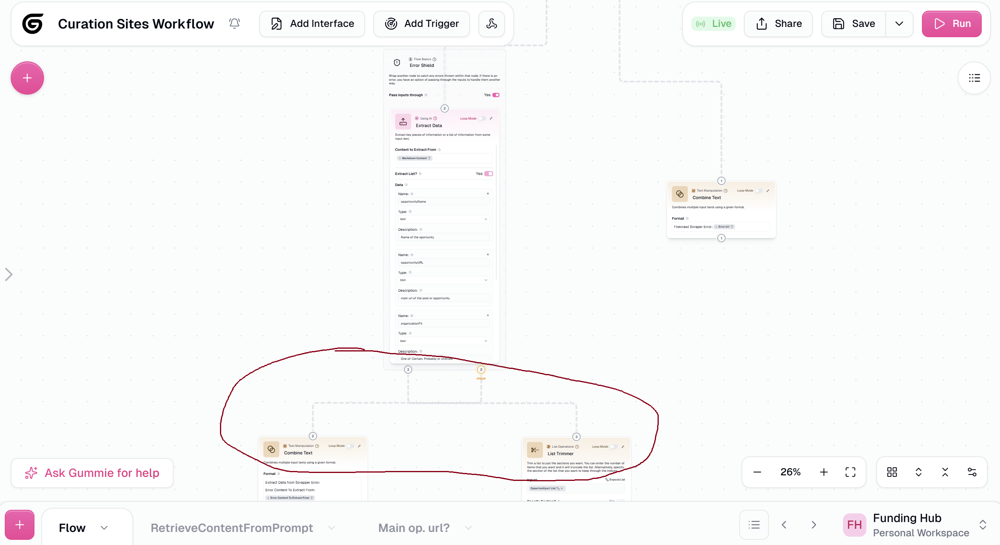

# [Bug] If-Else branch edges intertwine after saving a flow

**ID:** `BUG-001`
**Type:** `Bug`
**Priority:** `Medium`
**Area:** Canvas / Edge Routing
**Reported by:** Rafael Cabrera (power user — Funding Hub automation)
**Authored with:** Claude Code (AI-assisted writeup, verified by Rafael Cabrera)
**Date:** 2026-03-05

---

## Description

The If-Else node produces two outgoing edges — a `true` path and a `false` path — which route to separate downstream nodes (typically converging later at a **Join Paths** node). After saving a flow, these two edges visually cross and intertwine on the canvas instead of routing cleanly to their respective targets. The flow executes correctly — this is a purely visual rendering issue — but it makes branch logic significantly harder to read and debug at a glance, which is especially painful in production flows with multiple conditional branches.

## Steps to Reproduce

1. Build a flow with an If-Else node wrapping a target node, with distinct downstream nodes connected to its `true` and `false` output paths.
2. Arrange the canvas so the two branches are visually separated (e.g. `true` path going left, `false` path going right, or `true` going down-left and `false` going down-right).
3. Click **Save**.
4. Observe the edges exiting the If-Else node after save completes.

## Expected Behavior

Each outgoing edge routes cleanly and independently to its target — the `true` path edge goes directly to the true-branch node, the `false` path edge goes directly to the false-branch node. Both paths remain visually distinct and non-overlapping, as they were before saving.

## Actual Behavior

The `true` and `false` path edges cross over each other after save, creating a tangled/intertwined appearance. The visual separation between branches is lost, making it difficult to trace which path leads where. Flow execution is unaffected — this is purely a canvas rendering problem on save/reload.

## Screenshots

| Before Save | After Save |
|-------------|------------|
|  |  |

*The circled area in AfterSave.png shows the `true` and `false` path edges crossing instead of routing to their respective targets.*

## Proposed Fix / Implementation Notes

The edge routing algorithm likely recomputes bezier path curves on re-render after save without preserving the spatial context of each branch's target. Two candidate approaches:

1. **Persist edge routes:** Serialize the computed edge path geometry (control points or waypoints) as part of the saved flow state so edges are restored as-is on reload, rather than recalculated from scratch.
2. **Improve auto-routing:** After re-render, run a crossing-detection pass on edges sharing the same source node. For crossing pairs, swap or adjust bezier control points based on the relative position of each edge's target node (e.g. the edge going to the node further left should curve left, not right).

---

*Reported while building a grant discovery automation pipeline on Gumloop.*
