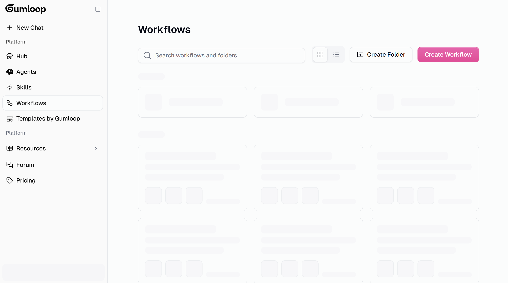

# [Bug / Performance] Workflows page takes 10+ seconds to load

**ID:** `BUG-002`
**Type:** `Bug / Performance`
**Priority:** `Low` *(client-side factors not fully ruled out — see notes)*
**Area:** Frontend / Workflows Page (`/flows`)
**Reported by:** Rafael Cabrera (power user — Funding Hub automation)
**Authored with:** Claude Code (AI-assisted writeup, verified by Rafael Cabrera)
**Date:** 2026-03-05

---

## Description

The Workflows page (`gumloop.com/flows`) consistently takes more than **10 seconds** to render on initial load. During this time, the entire page displays a skeleton loader — no workflows, folders, or metadata are visible. The page is functionally blocked until the data arrives.

> **Note on confidence:** I have not captured network timing data (HAR file / DevTools waterfall) to confirm this is server-side. Fast hardware and a reliable internet connection were used, and the issue reproduces consistently across two different browsers (Comet and Edge). This makes a client-side cause unlikely, but it cannot be fully ruled out without server-side profiling.

## Steps to Reproduce

1. Navigate to `https://www.gumloop.com/flows` (logged in).
2. Observe time from page load to workflows being visible.

## Expected Behavior

Workflows list renders within 2–3 seconds at most. Ideally, the page uses progressive loading — showing already-cached or recently-accessed workflows immediately while fetching the full list in the background.

## Actual Behavior

The entire page renders as a skeleton for 10+ seconds before any workflow cards appear. There is no partial load or progressive rendering — it's all-or-nothing.

## Environment

- **Browsers tested:** Comet, Microsoft Edge
- **Hardware:** Fast laptop, fast internet connection
- **Workspace size:** Multiple workflows across folders

## Screenshot

*Screenshot captured mid-load — the entire grid is skeleton placeholders, with no content visible after several seconds.*

## Hypothesis / Proposed Investigation

The skeleton covering the entire page suggests the frontend is waiting on a **single blocking API call** to return the full workflow list before rendering anything. Likely culprits:

1. **No pagination or lazy loading** — the API fetches all workflows in one request. As the workspace grows, this request grows linearly.
2. **No client-side cache** — each page visit triggers a full refetch, with no stale-while-revalidate pattern.
3. **Cold start / server-side latency** — the API endpoint itself may have a slow cold start or heavy DB query for the workflow index.

**Suggested fix directions:**
- Implement **pagination or cursor-based loading** on the workflows list API.
- Use a **stale-while-revalidate** strategy: render cached data immediately, then refresh in the background.
- Profile the `/flows` API endpoint response time in production to confirm server-side latency and identify the bottleneck.

---

*Reported while building a grant discovery automation pipeline on Gumloop. Consistently reproduced over multiple sessions.*
