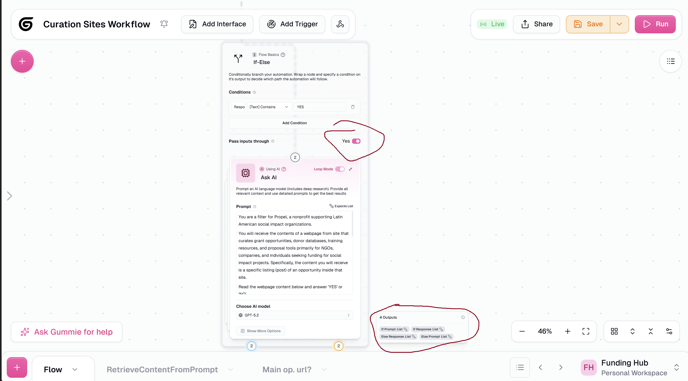

# [Feature] If-Else "Pass Inputs Through" should expose raw variable values, not the fully-rendered prompt

**ID:** `FEAT-001`
**Type:** `Feature Request`
**Priority:** `Medium`
**Area:** If-Else Node / Pass Inputs Through
**Reported by:** Rafael Cabrera (power user — Funding Hub automation)
**Authored with:** Claude Code (AI-assisted writeup, verified by Rafael Cabrera)
**Date:** 2026-03-05

---

## Description

The If-Else node's **Pass Inputs Through** option is designed to make the wrapped node's input values available as downstream outputs — useful for passing data through a conditional branch without re-fetching it. However, when the wrapped node is an **Ask AI** node, the pass-through output exposes the **fully-rendered prompt string** (i.e. the prompt template with all variable values already substituted in), rather than the **individual raw variable values** that were injected into it.

This means that if the prompt is:

```
You are a filter for Propel... Read the webpage content below and answer YES or not:

{markdown_content}
```

The pass-through output becomes the entire string — `"You are a filter... {actual 10,000-character markdown blob}"` — when what the user actually needs downstream is just the original `{markdown_content}` value.

As a result, users are forced to add an extra downstream node (e.g. a text manipulation or extraction node) just to recover an input value that was already available before the If-Else. This defeats the purpose of the feature and creates unnecessary node bloat in workflows.

## Current Behavior

**Pass Inputs Through** outputs the full rendered prompt of the wrapped Ask AI node — the prompt template with all referenced variables already resolved and concatenated into a single string.

## Expected / Proposed Behavior

**Pass Inputs Through** should expose each input variable **individually** as a separate output, using the variable's original name (or the node input field name) as the output label. For example:

| Current output | Proposed outputs |
|---|---|
| `Pass Through (txt)` → `"You are a filter... {full markdown}"` | `markdown_content (txt)` → `"{raw markdown value}"` |

This way, downstream nodes can directly reference `markdown_content` without any intermediate extraction step.

## Alternatively

If exposing individual variables is architecturally complex, a simpler improvement would be to expose **both**:
- The rendered prompt (current behavior, renamed to `Rendered Prompt` for clarity)
- Each individual input variable value as a separate output

## Screenshots



*The outputs panel shows "Pass Through" containing the full rendered prompt string rather than the individual variable values injected into it.*

## Impact

This affects any workflow where:
- An If-Else wraps an Ask AI node (a very common pattern)
- The user needs to carry one of the prompt's input variables forward into the true or false branch

Workaround: add a downstream node to manually extract the needed value — adds friction and node bloat.

---

*Reported while building a grant discovery automation pipeline on Gumloop.*
