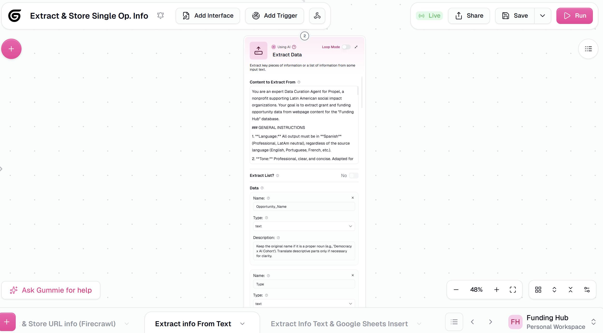

# [Feature] Extract Data node should support mandatory fields with LLM retry on missing values

**ID:** `FEAT-002`
**Type:** `Feature Request`
**Priority:** `Medium`
**Area:** Extract Data Node / Field Schema
**Reported by:** Rafael Cabrera (power user — Funding Hub automation)
**Authored with:** Claude Code (AI-assisted writeup, verified by Rafael Cabrera)
**Date:** 2026-03-05

---

## Description

The **Extract Data** node lets users define fields to extract (Name, Type, Description) but treats all fields as optional by default — if the LLM doesn't return a value for a field, the node silently passes an empty/null output downstream with no warning or retry. This is a significant reliability gap for production workflows that depend on specific fields being populated.

The feature request is to add a **"Required"** toggle (checkbox or switch) per field in the Data Fields to Extract list. When a field is marked required and the LLM returns it empty or missing, the node should trigger a **validation-and-retry loop** before failing — prompting the LLM to correct the incomplete extraction rather than silently propagating a null value.

## Current Behavior

All extraction fields are implicitly optional. If the LLM omits a field or returns an empty value, the node succeeds and passes the empty output downstream. Downstream nodes then fail silently or produce incorrect results, with no indication at the Extract Data node level that something went wrong.

## Expected / Proposed Behavior

Each field in the **Data Fields to Extract** list should have a **"Required"** checkbox. When enabled:

1. After the LLM returns the extracted data, the node validates that all required fields are present and non-empty.
2. If any required field is missing or empty, the node constructs a correction prompt:
   > *"The following required fields were not extracted: `[field_name]`. Please re-read the source text and extract them."*
3. The LLM is called again with the correction prompt (up to a configurable max retries, e.g. 2).
4. If the field is still missing after all retries, the node raises a structured error — surfacing clearly which field failed — rather than passing an empty value downstream.

## UI Proposal

In the Data Fields to Extract section, add a **"Required"** column alongside Name / Type / Description:

| Name | Type | Description | Required |
|------|------|-------------|----------|
| opportunity_name | text | Name of the grant opportunity | ✅ |
| deadline | text | Application deadline date | ✅ |
| eligibility | text | Who can apply | ☐ |

## Screenshot

*The field definition UI (Name, Type, Description) has no mechanism to mark a field as required or trigger retry on missing values.*

## Proposed Implementation Notes

This is essentially a **structured output validation loop** applied at the node level — a well-established pattern in LLM engineering:

- After extraction, run a schema check: for each required field, assert `value != null && value != ""`.
- On failure, construct a targeted correction prompt referencing only the missing fields.
- Re-invoke the LLM (same model, same context) up to N times.
- If still failing after N retries, raise a node-level error with a clear message: `"Required field 'deadline' could not be extracted after 2 attempts."`

This is model-agnostic and complements the existing AI Model Fallback feature — fallback handles model availability, this handles output completeness.

## Impact

Critical for workflows where downstream nodes (e.g. Google Sheets writers, Salesforce updaters) depend on specific fields being populated. Without this, a single missed LLM extraction silently corrupts the entire downstream pipeline with no visibility at the node level.

---

*Reported while building a grant discovery automation pipeline on Gumloop — extracting 21 structured fields per grant opportunity, where missing mandatory fields (deadline, amount, eligibility) break the downstream Salesforce sync.*
