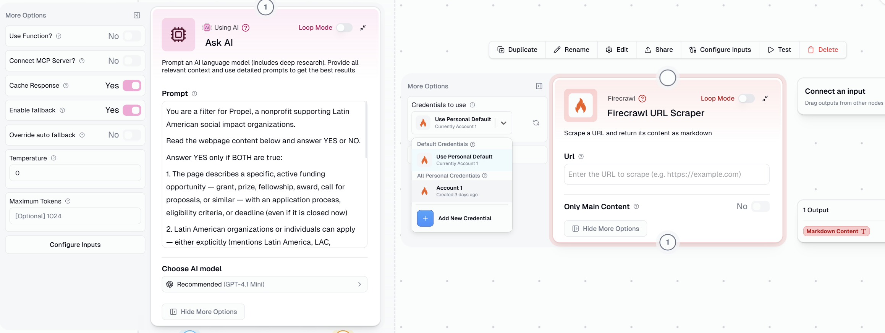

# [Feature] AI nodes should support per-node credential selection (own API key vs. Gumloop credits)

**ID:** `FEAT-003`
**Type:** `Feature Request`
**Priority:** `Medium`
**Area:** Ask AI / Extract Data / AI Nodes — Credentials
**Reported by:** Rafael Cabrera (power user — Funding Hub automation)
**Authored with:** Claude Code (AI-assisted writeup, verified by Rafael Cabrera)
**Date:** 2026-03-05

---

## Description

Gumloop already supports bringing your own API key to reduce AI node costs to **1 credit** — but this is configured account-wide in the credentials settings page, not at the individual node level. There is no way to choose, per node, whether to run it using Gumloop's managed credits or a specific API key stored in your credentials.

This creates a frustrating all-or-nothing situation: either all AI nodes in all flows use your own key, or none do. Users who want to use their own OpenAI key for expensive extraction jobs but Gumloop credits for lightweight tasks have no way to mix and match.

The fix already exists in the codebase — the **Firecrawl node** implements exactly this pattern via a **"Credentials to use"** selector in its node panel (under More Options), where users can pick between personal default, a specific saved credential, or add a new one inline. AI nodes (Ask AI, Extract Data, and others) should have the same.

## Current Behavior

AI nodes (Ask AI, Extract Data, Categorizer, Scorer, etc.) have no per-node credential selector. The only way to use a personal API key is to set it account-wide in Settings → Credentials, which applies globally to all AI nodes across all flows. There is no per-node override.

## Expected / Proposed Behavior

Add a **"Credentials to use"** selector to the **More Options** section of all AI nodes, consistent with the existing Firecrawl node implementation. The selector should offer:

- **Use Gumloop Credits** (default) — current behavior, no change
- **Use Personal Default** — uses the API key set as default in account credentials
- **[saved credential name]** — pick a specific saved API key (e.g. `OpenAI - Production`, `Anthropic - Personal`)
- **Add New Credential** — inline shortcut to add a credential without leaving the flow editor

This gives users full per-node control: use cheap personal API keys for heavy extraction jobs, Gumloop credits for quick utility nodes — in the same flow.

## Screenshots

*Left: Ask AI node's More Options — no credential selector. Right: Firecrawl node — "Credentials to use" dropdown already implemented with personal default, saved credentials, and "Add New Credential" inline.*

## Proposed Implementation Notes

The Firecrawl node's credential selector is already built and working — this is a **feature parity** issue, not a net new feature. The same component and credential resolution logic should be wired into:

- **Ask AI**
- **Extract Data**
- **Categorizer**
- **Scorer**
- **AI Filter**
- **AI List Sorter**
- **Generate Report**
- Any other node that bills AI model usage

The credential selector should resolve at runtime: if a credential is selected, use its API key and bill 1 credit (infrastructure only); if "Use Gumloop Credits" is selected, use the managed key and bill the standard model-tier credit cost.

## Impact

High — directly affects cost management for power users running high-volume AI workflows. A user running 1,000 Extract Data calls/week on an Expert model pays ~20,000 credits vs. ~1,000 credits with their own key. The inability to target this per-node means users either accept the full cost or give up per-flow flexibility.

---

*Reported while building a grant discovery automation pipeline on Gumloop — running Extract Data on 100+ URLs per batch with a 21-field schema, where per-node key selection would significantly reduce run costs.*
